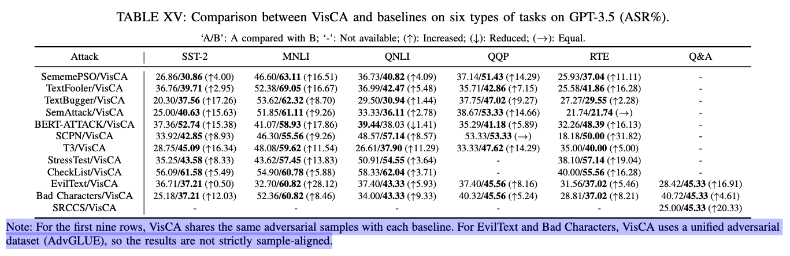
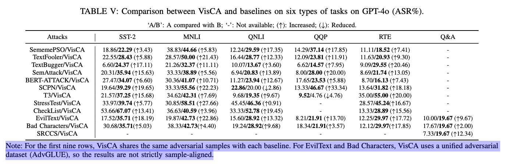

# VisCA-Rebuttal

## C2: Choice of GPT-2 (1475A, 1475B)
### 1. Prior work
[29] J. Shi, Y. Liu, P. Zhou, and L. Sun, “Poster: Badgpt: Exploring security vulnerabilities of chatgpt via backdoor attacks to instructgpt,” in 30th Annual Network and Distributed System Security Symposium, NDSS 2023, 2023.

### 2. Comparison of GPT-2 against LLaMA-2, Gemma-2, and E5-base in VisCA’s candidate selection

## C3: ASR interpretation of Table V and Table XV (1475A, 1475B)

## 1475A_Response
### 1. Spelling Correction Resilience (Section V-E-(2))
VisCA’s Eye-only strategy transposes adjacent letters to mimic natural typing or visual perception errors. Most spell checkers avoid correcting such patterns, especially when the result still forms a plausible word (e.g., “lvoe” instead of “love”). In some cases, the transposition even results in another valid word with a different meaning (e.g., “form” $\rightarrow$ “from”, “calm” $\rightarrow$ “clam”, “stop” $\rightarrow$ “spot”), which are syntactically correct and unlikely to be corrected. These subtle yet valid changes reduce the chance of detection and can lead LLMs to incorrect interpretations. In contrast, EvilText uses homoglyph substitutions that retain word structure but bypass Unicode-based detection, while Bad Characters injects invisible symbols, which are ignored by spell checkers. Thus, VisCA, like these baselines, remains robust against standard spelling correction, while uniquely leveraging human-like errors to mislead LLMs.

### 2. Performance on reasoning model (Section V-F-(2))
We observe that VisCA has relatively lower ASR on advanced reasoning models like DeepSeek-R1 and GPT-4.5. This may be attributed to their enhanced contextual understanding and reasoning capabilities, which help mitigate the subtle character-level perturbations introduced by VisCA. Such models are better at detecting and compensating for minor textual inconsistencies, thus reducing attack effectiveness. Nevertheless, VisCA still achieves notable ASR improvements over baselines, demonstrating robustness even against advanced reasoning LLMs.

## 1475B_Response
### 1. Robustness under Task-agnostic Word Selection
To evaluate the robustness and adaptability of VisCA in scenarios where task type is unknown or mixed, we conducted an additional experiment using a task-agnostic word selection strategy. Instead of relying on task-specific heuristics (e.g., using sentiment words for SST-2), we employed KeyBERT, an unsupervised keyword extractor, to identify salient words in each input without referring to task labels. We constructed a hybrid evaluation set by randomly sampling 50 instances from each of the six tasks used in our main experiments, resulting in a total of 300 diverse examples. For each input, we extracted the top-3 keywords using KeyBERT and apply character transposition and substitution on them. All other attack configurations (e.g., perturbation rules, query protocols, and target model) remain remain identical to those in the task-aware setup. Table XIII presents the ASR of VisCA under both strategies. The task-agnostic variant achieves an ASR of 19.00%, with a relative drop of 11.67 percentage points compared to the task-aware version. Despite this reduction, the results demonstrate that VisCA retains strong effectiveness even without access to task-specific information, and remains robust under general-purpose word selection strategies.

### 2. Each character’s Unicode code point

