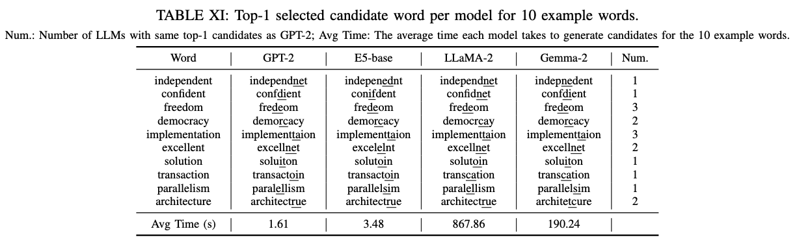
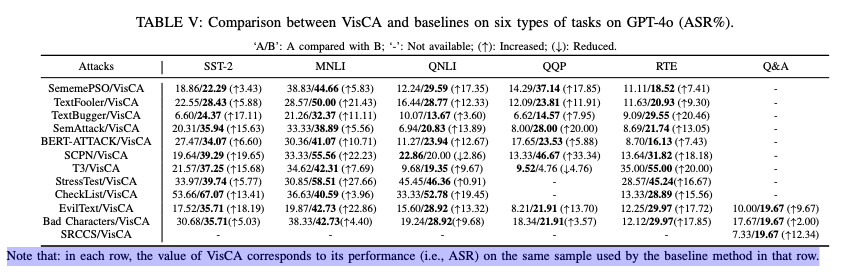
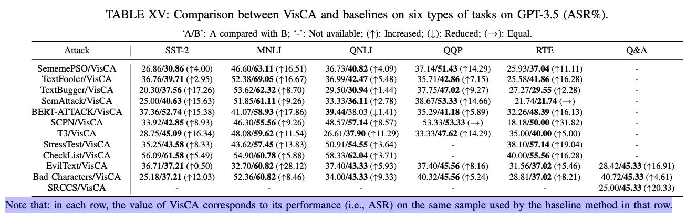

# VisCA-Rebuttal

## C1: Threat model realism and motivation for stealthiness (1475A, 1475B)
### 1. Section IV-A: Threat model
* **Adversary Goal**: The adversary aims to manipulate the inputs fed into an LLM (i.e., the victim model such as ChatGPT), in order to induce incorrect or misleading outputs. These perturbed outputs may influence downstream users or decision-making systems. Importantly, the adversary seeks to achieve this goal while preserving the readability and semantic consistency of the original input, so that the perturbations remain imperceptible to human reviewers or automatic detectors. Therefore, instead of overtly altering key concepts (e.g., changing “independent” to “dependent”), the adversary focuses on stealthy perturbations that subtly interfere with the model's behavior while minimizing user awareness.
* **Adversary Knowledge**: We assume a black-box threat model. The adversary has no access to the internal architecture, training data, or parameters of the victim model (e.g., ChatGPT), but can interact with it through input-output queries. This allows the adversary to observe how output responses change in response to crafted inputs.
* **Adversary Capability**: The adversary is assumed to have control over the final form of the user input received by the LLM, for example by intercepting the prompt in transit or injecting imperceptible perturbations at the interface layer (e.g., clipboard, browser extensions, proxy APIs). However, the adversary is constrained in that they cannot drastically change the prompt content; the modified input must remain semantically and syntactically plausible to avoid suspicion. In addition, the adversary has sufficient computational resources to perform various computational tasks, such as representing large amounts of texts as vectors and performing various computational operations.
### 2. Section VI-D: Real-world VisCA deployment
* VisCA's low-cost, non-iterative, and visually imperceptible perturbation strategy makes it particularly suitable for real-world threat models, such as Man-In-The-Middle (MITM) attacks or malicious client-side manipulations. In practice, user queries sent to LLMs can pass through multiple components-including web browsers, third-party applications, proxy APIs, or cloud services—before reaching the model. These intermediary components may be compromised or malicious, enabling attackers to subtly inject perturbations into user inputs without altering their appearance to the user. Such attacks are especially viable in scenarios involving AI-assisted healthcare, legal, or financial services, where inputs are often pre-processed or forwarded by upstream systems before reaching the LLM. In these cases, the attacker may not wish to dramatically alter the input (which could trigger user suspicion or validation mechanisms), but instead employ stealthy, character-level perturbations that influence the LLM's output in a targeted way. Unlike traditional white-box attacks or semantically disruptive manipulations, VisCA enables lightweight and stealthy perturbations that work in real-time and preserve the original input's surface form. This makes it a realistic and dangerous attack vector in deployed black-box systems, emphasizing the urgent need for robust defenses against such invisible manipulations.

## C2: Choice of GPT-2 (1475A, 1475B)
### 1. Prior work
[29] J. Shi, Y. Liu, P. Zhou, and L. Sun, “Poster: Badgpt: Exploring security vulnerabilities of chatgpt via backdoor attacks to instructgpt,” in 30th Annual Network and Distributed System Security Symposium, NDSS 2023, 2023.
### 2. Comparison of GPT-2 against LLaMA-2, Gemma-2, and E5-base in VisCA’s candidate selection

## C3: ASR interpretation of Table V and Table XV (1475A, 1475B)

